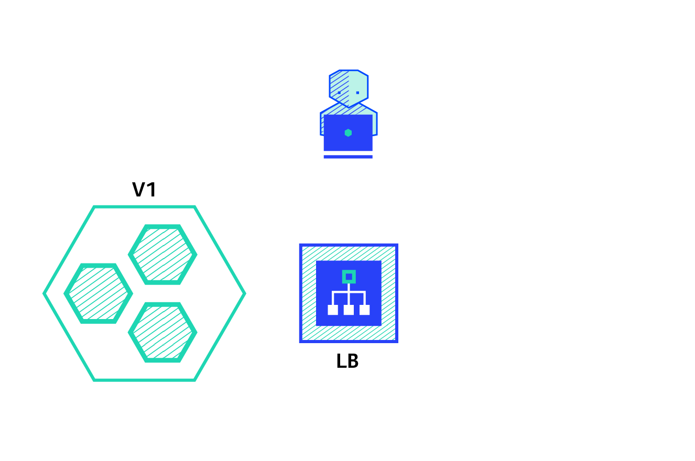

# Recreate

A deployment defined with a strategy of type Recreate will terminate all the running instances then recreate them with the newer version.



# Deploy App v1

```bash
kubectl apply -f app-v1.yaml
```

Get IP address:

```bash
export IP_ADDRESS=`kubectl -n ingress-nginx get svc nginx-ingress-controller -o json | jq -r '.status.loadBalancer.ingress[0].ip'` 
```

Test:

```bash
curl http://$IP_ADDRESS/api
```

Or in browser:
<http://$IP_ADDRESS>

# Deploy App v2

```bash
kubectl apply -f app-v2.yaml
```

Downtime is expected because v1 is killed before v2 is started and healthy:

```bash
curl http://$IP_ADDRESS/api
```

Or in browser:
<http://$IP_ADDRESS>

# Cleanup 

```bash
kubectl delete -f app-v1.yaml
kubectl delete -f app-v2.yaml
```
